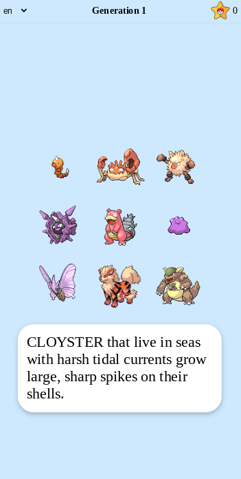

# Pokemon Guessing Game

Guess the pokemon that matches the description and work your way through the generations 1-9. 
Choose from the following languages: English, Korean, French, German, Spanish, Italian and Japanese. 

Here is a link to a live demo: https://friedrichtenhagen.github.io/api-project/

## Lessons learned:

Connecting to an API with Javascript and manipulating the DOM. 

